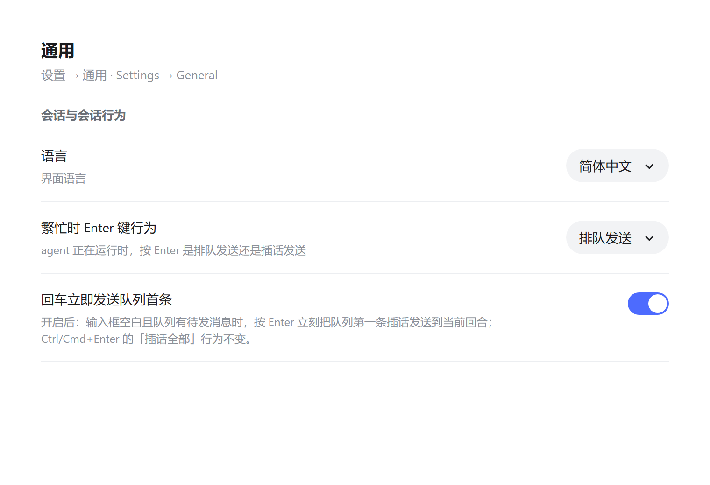

# dsh-queue-first-enter

[English](README.md) | 中文

DeepSeek Harness（dsh）Web 插件：**输入框空白时按 Enter，立即把队列第一条消息插话发送到正在运行的回合。**

agent 繁忙时，输入框的回车会把下一条消息排进队列，而排队消息通常要等当前回合结束。本插件只加一个手势：清空输入框、按 Enter，队列里的**第一条**消息就在当前回合的下一个步进边界被送入模型，其余排队消息保持原顺序。



## 安装

```sh
dsh plugin --profile web add dsh-queue-first-enter
```

然后重启 `dsh web`。

从本地检出安装：

```sh
dsh plugin --profile web add /path/to/dsh-queue-first-enter
```

需要 `dsh web` 0.1.0-rc.6 或更新版本。浏览器半边是 `dsh.client` 包（`platform: web`）；宿主半边不带任何行为，只是为了让这个包成为一行正常可安装的插件。

## 行为

只有以下条件**全部**成立时才会触发：

- 输入框空白——没有文字，也没有待发图片；
- 当前 agent 正在运行（回合进行中）；
- 队列里至少有一条 `placement: queued` 的消息；
- 输入框可用，且当前是普通会话（不是子 agent）。

其余情况一律不动：

- 有文字或图片时，Enter 与原来完全一致（排队或直接发送）；
- `Ctrl`/`Cmd`+`Enter` 保留自带含义——插话发送**全部**排队消息；
- 在设置里关掉本功能后，空输入框按 Enter 恢复为原本的无动作。

发送方式为严格插话（strict steer）：消息在当前回合的下一个步进边界交给该回合，模型那时就能看到。它**不**中断当前回合，也**不**等回合结束。dsh 的队列 API 只有编辑、删除、插话三种操作，所以「跳过当前回合直接开新回合」不是本插件做的事；中断回合是另一个破坏性动作（`cancel`，保留队列）。

收敛行为：回合在同一瞬间结束（`steer-unavailable`）或消息已被 agent 领取（`queue-item-not-found`）时静默收敛，消息仍留在队列里。

## 设置

**设置 → 通用 → 「回车立即发送队列首条」**，就在 dsh 自带的「繁忙时 Enter 键行为」下面一行。

开关状态存在浏览器 `localStorage` 的 `dsh.queueFirstEnter.enabled`（默认开启）。

## 实现说明

| 文件 | 作用 |
| --- | --- |
| `index.js` | 宿主半边：不带宿主行为，只为让包可挂载。 |
| `client.js` | 浏览器半边：通过客户端 slot 系统注册输入框监听与设置行。 |
| `cordis.patch.yml` | 把宿主行插进 profile 的层栈。 |
| `smoke-test.mjs` | 用桩模块系统和桩 Cordis 上下文加载 `client.js`，断言两个 slot 都注册成功。 |

监听器以捕获阶段挂在输入框自己的 `textarea` 上，定位方式是插件自己的锚点元素向上找到 composer 卡片再取其中的 `textarea`——没有使用产品 CSS 类名，也没有写死 DOM 路径。它读取权威的 `session/queue` 快照，调用已有的 `updateQueue(itemId, { kind: 'steer' })` RPC；自己不发 prompt、不访问网络，除开关状态外不存储任何东西。

上面的截图由 `screenshots/settings-mockup.html` 渲染而来：这是一个静态的设置 → 通用面板模拟，复用了产品自带的设置行尺寸和插件自身的行内样式。用浏览器打开它，就能看到这一行真实渲染的样子。

```sh
npm test          # node smoke-test.mjs
npm run check     # 两个半边都跑 node --check
```

## 许可

MIT
